# EDA.CleanArch.DDD.CQRS.EventSourcing

Note. _Greg Young takes the next steps beyond the DDD principles and best practices introduced by Eric Evans in **Domain-Driven Design: Tackling Complexity in the Heart of Software**, using DDD with **Command-Query Responsibility Segregation** (CQRS) and **event sourcing** to simplify construction, decentralize decision-making, and make system development more flexible and responsive._ Adapted from "Event Centric: Finding Simplicity in Complex Systems" by Y. Greg, 2012.

This project uses the **EventStorming** workshop to identify the business capabilities and the respective **Bounded Contexts** of a simple e-commerce, as well as the integration events that occur between them. In addition to demonstrating the implementation under an **Event-driven architecture** (EDA), through an **event-sourcing** design supported by the **CQRS** pattern in a **Clean Architecture**.

> State transitions are an important part of our problem space and should be modelled within our domain.    
> -- <cite> Greg Young </cite>

### Give a Star! :star:

## Event-driven architecture (EDA)
> Event-driven architecture (EDA) is a software architecture paradigm promoting the production, detection, consumption of, and reaction to events. An event can be defined as "a significant change in state".      
> 
> "Event-driven architecture." *Wikipedia*, Wikimedia Foundation, last edited on 9 May 2021.  
> https://en.wikipedia.org/wiki/Event-driven_architecture

 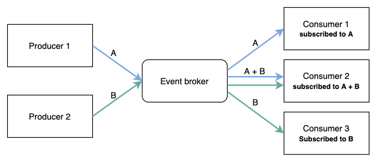    
 Fig. 1: Uit de Bos, Oskar. *A simple illustration of events using the publish/subscribe messaging model*.    
 https://medium.com/swlh/the-engineers-guide-to-event-driven-architectures-benefits-and-challenges-3e96ded8568b

<br>

The following table shows how EDA and Microservices architectural styles compliment each other:

| EDA | Microservices Architecture |
|---|---|
| Loose coupling between components/services | Bounded context which provides separation of concerns |
| Ability to scale individual components | Independently deployable & scalable |
| Processing components can be developed independent of each other | Support for polyglot programming |
| High cloud affinity | Cloud native |
| Asynchronous nature. As well as ability to throttle workload | Elastic scalability |
| Fault Tolerance and better resiliency | Good observability to detect failures quickly |
| Ability to build processing pipelines | Evolutionary in nature |
| Availability of sophisticated event brokers reduce code complexity | Set of standard reusable technical services often referred as `MicroServices Chassis`  |
| A rich palate of proven [Enterprise Integration Patterns](https://www.enterpriseintegrationpatterns.com/) | Provides a rich repository of reusable [implementation patterns](https://microservices.io/patterns/microservices.html) |
  
Table 1: Ambre, Tanmay. *Architectural styles compliment*, Architectural considerations for event-driven microservices-based systems.    
https://developer.ibm.com/articles/eda-and-microservices-architecture-best-practices/

## Event sourcing

> Instead of storing just the current state of the data in a domain, use an append-only store to record the full series of actions taken on that data. The store acts as the system of record and can be used to materialize the domain objects. This can simplify tasks in complex domains, by avoiding the need to synchronize the data model and the business domain, while improving performance, scalability, and responsiveness. It can also provide consistency for transactional data, and maintain full audit trails and history that can enable compensating actions.
>
> "Event Sourcing pattern" *MSDN*, Microsoft Docs, last edited on 23 Jun 2017.  
> https://docs.microsoft.com/en-us/azure/architecture/patterns/event-sourcing

> We can query an application's state to find out the current state of the world, and this answers many questions. However there are times when we don't just want to see where we are, we also want to know how we got there.
> 
> Event Sourcing ensures that all changes to application state are stored as a sequence of events. Not just can we query these events, we can also use the event log to reconstruct past states, and as a foundation to automatically adjust the state to cope with retroactive changes.
>
> Fowler, Martin. "Eventsourcing," *martinfowler.com*, last edited on 12 Dec 2005.     
> https://martinfowler.com/eaaDev/EventSourcing.html

<br>

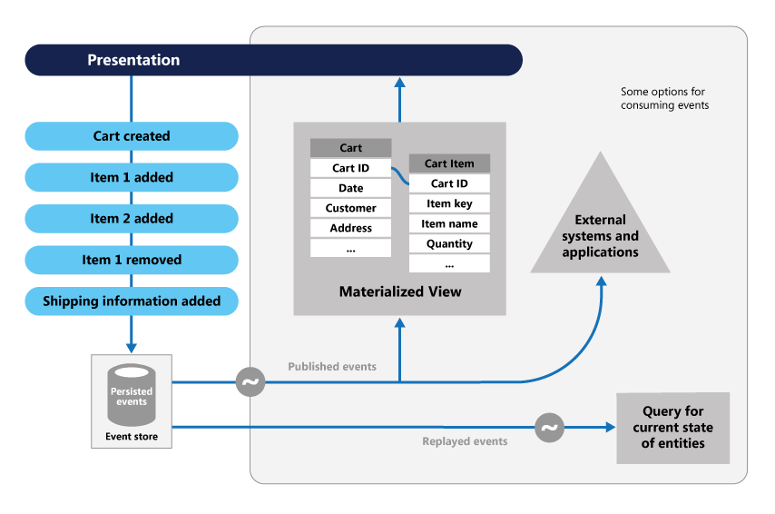  
Fig. 2: MSDN. *Event Sourcing pattern*.    
https://microservices.io/patterns/data/event-sourcing.html

### Event Store/Stream

> So, Event Sourcing is the persistence mechanism where each state transition for a given entity is represented as a domain event that gets persisted to an event database (event store). When the entity state mutates, a new event is produced and saved. When we need to restore the entity state, we read all the events for that entity and apply each event to change the state, reaching the correct final state of the entity when all available events are read and applied.
>
> Zimarev, Alexey. "What is Event Sourcing?", *Event Store blog*, last edited on 03 June 2020.   
> https://www.eventstore.com/blog/what-is-event-sourcing

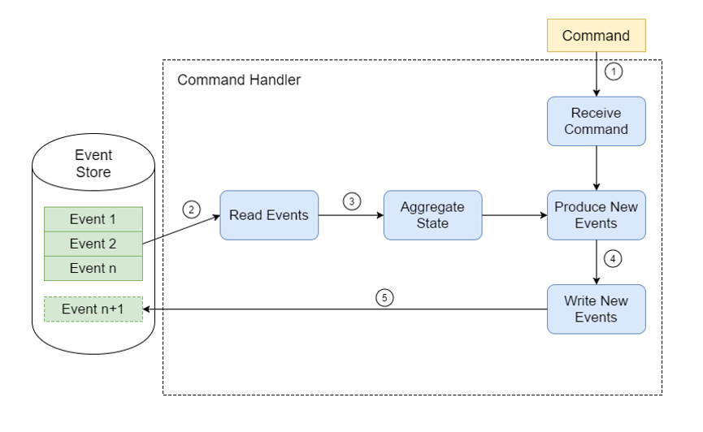  
Fig. 3: Shilkov, Mikhail. *Event Sourcing and IO Complexity*.    
https://mikhail.io/2016/11/event-sourcing-and-io-complexity/

State transition during events applying: 

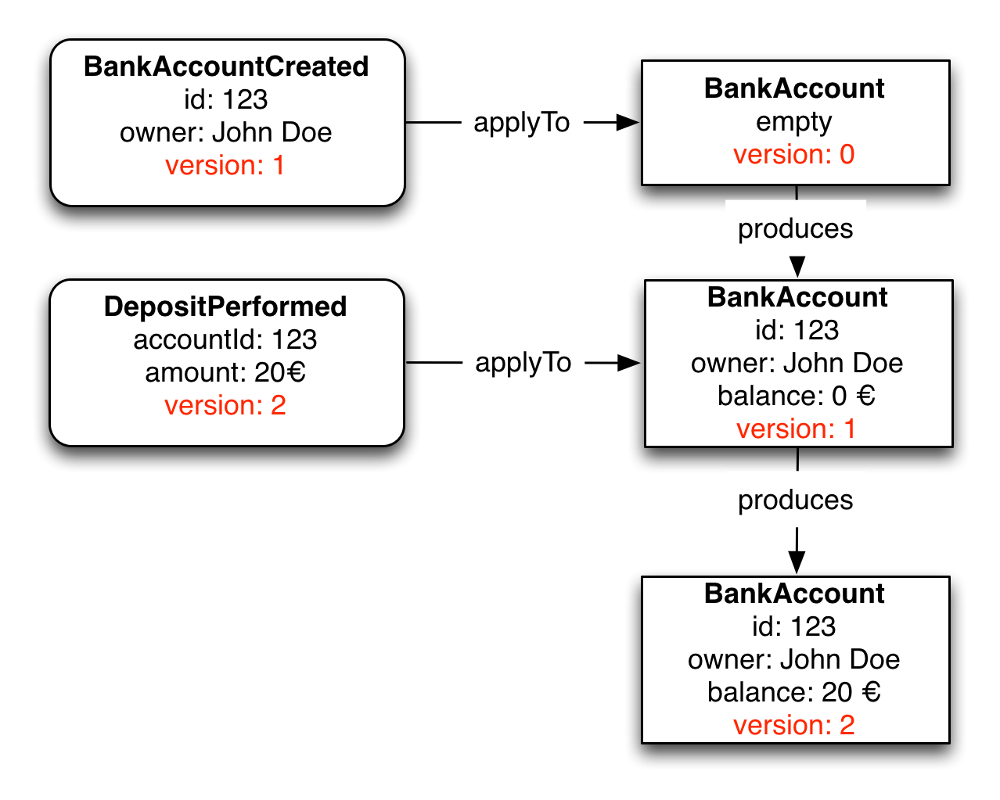
Fig. 4: Reitzammer, Benjamin & Seitz, Johannes. *Event Sourcingin practice*.    
https://ookami86.github.io/event-sourcing-in-practice/#title.md

The following picture shows the difference between approaches:

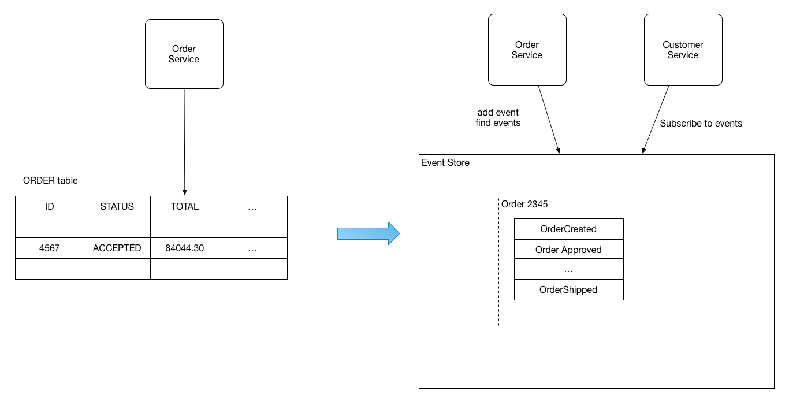
Fig. 5: Richardson, Chris. *Pattern: Event sourcing*.    
https://microservices.io/patterns/data/event-sourcing.html

### Snapshot

> Once you understand how Event Sourcing works, the most common thought is: “What happens when you have a lot of Events? Won’t it be inefficient to fetch every event from the event stream and replay all of them to get to the current state?”. It might be. But to combat this, you can use snapshots in event sourcing to rehydrate aggregates. Snapshots give you a representation of your aggregates state at a point in time. You can then use this as a checkpoint and then only replay the events since the snapshot.
>
> Comartin, Derek. "Snapshots in Event Sourcing for Rehydrating Aggregates", *codeopinion.com*, last edited on 17 Mar 2021.   
> https://codeopinion.com/snapshots-in-event-sourcing-for-rehydrating-aggregates/

> Snapshotting is an optimisation that reduces time spent on reading event from an event store. If for example a stream contains thousands of events, and we need to read all of them every time, then the time the system takes to handle a command will be noticeable. What we can do instead is to create a snapshot of the aggregate state and save it. Then before a command is handled we can load the latest snapshot and only new events since the snapshot was created.
>
> Gunia, Kacper. "Event Sourcing: Snapshotting", *domaincentric.net*, last edited on 5 Jun 2020.   
> https://domaincentric.net/blog/event-sourcing-snapshotting

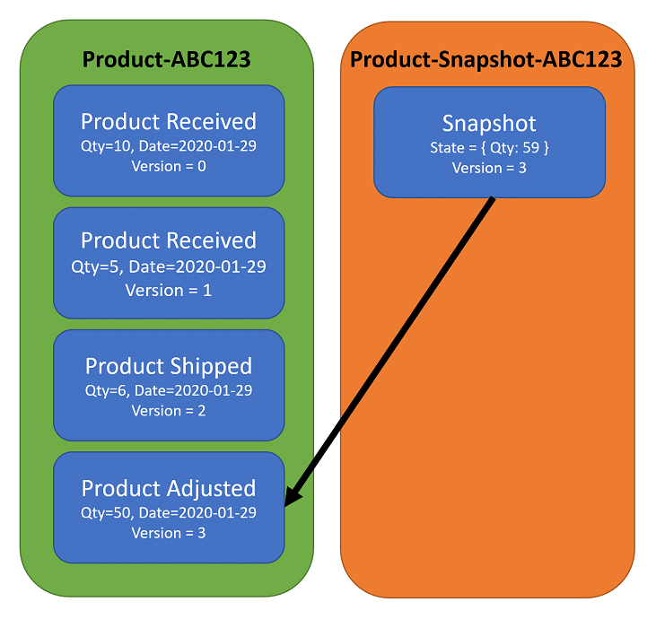  
Fig. 6: Comartin, Derek. *Snapshots in Event Sourcing for Rehydrating Aggregates*.    
https://codeopinion.com/snapshots-in-event-sourcing-for-rehydrating-aggregates/

Snapshot stream:

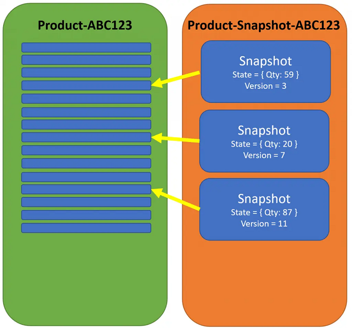  
Fig. 7: Comartin, Derek. *Snapshots in Event Sourcing for Rehydrating Aggregates*.    
https://codeopinion.com/snapshots-in-event-sourcing-for-rehydrating-aggregates/

## EDA + Event-sourcing

> Event sourcing a system means the treatment of events as the source of truth. In principle, until an event is made durable within the system, it cannot be processed any further. Just like an author’s story is not a story at all until it’s written, an event should not be projected, replayed, published or otherwise processed until it’s durable enough such as being persisted to a data store. Other designs where the event is secondary cannot rightfully claim to be event sourced but instead merely an event-logging system.
>
>Combining EDA with the event-sourcing pattern is another increment of the system’s design because of the alignment of the EDA principle that events are the units of change and the event-sourcing principle that events should be stored first and foremost.
>
> Go, Jayson. "From Monolith to Event-Driven: Finding Seams in Your Future Architecture", *InfoQ*, last edited on 15 Set 2020.   
> https://www.eventstore.com/blog/what-is-event-sourcing

Comparison overview:

| Aspects  | Event sourcing | EDA |
|---|---|---|
| Propose | Keeping history | Highly adaptable and scalable |
| Scope | Single application/system | Whole organisation/several apps |
| Storage | Central event store | Decentralised |
| Testing | Easier | Harder |

Table 2: Lorio, Pablo. *Comparison overview*, Event driven architectures vs event sourcing patterns.    
https://pablo-iorio.medium.com/event-driven-architectures-vs-event-sourcing-patterns-23d328289bf9

<br>

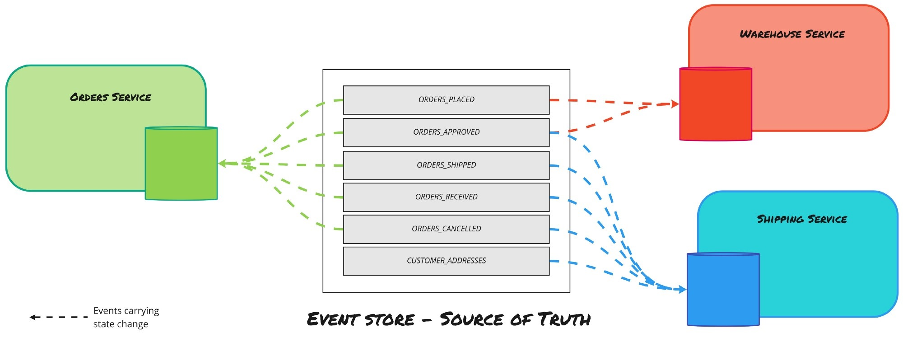
Fig. 8: Nowak, Aleksander. *Understanding Event-Driven Design Patterns for Microservices*.    
https://levelup.gitconnected.com/understanding-event-driven-design-patterns-for-microservices-659b3c9fb51f

## CQRS
> CQRS stands for Command and Query Responsibility Segregation, a pattern that separates read and update operations for a data store. Implementing CQRS in your application can maximize its performance, scalability, and security. The flexibility created by migrating to CQRS allows a system to better evolve over time and prevents update commands from causing merge conflicts at the domain level.
>
> "What is the CQRS pattern?" *MSDN*, Microsoft Docs, last edited on 2 Nov 2020.  
> https://docs.microsoft.com/en-us/azure/architecture/patterns/cqrs

<br>

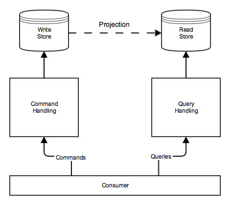   
Fig. 9: Bürckel, Marco. *Some thoughts on using CQRS without Event Sourcing*.    
https://medium.com/@mbue/some-thoughts-on-using-cqrs-without-event-sourcing-938b878166a2

<br>

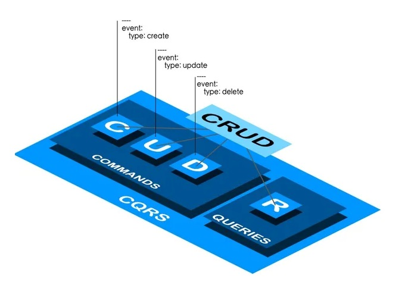   
Fig. 10: Go, Jayson. *From Monolith to Event-Driven: Finding Seams in Your Future Architecture*.    
https://www.eventstore.com/blog/what-is-event-sourcing

### Projections
To cover this topic was prepared [this presentation](https://www.canva.com/design/DAEY9ttmPgY/F_lh7TXQEdG-su-qojEjdw/view?utm_content=DAEY9ttmPgY&utm_campaign=designshare&utm_medium=link&utm_source=publishsharelink) with some different strategies and ways to implement projections.

## Event-sourcing + CQRS 

> CQRS and Event Sourcing have a symbiotic relationship. CQRS allows Event Sourcing to be used as the
data storage mechanism for the domain.  
> 
> Young Greg, 2012, *CQRS and Event Sourcing*, **CQRS Documents by Greg Young**, p50. 

> The CQRS pattern is often used along with the Event Sourcing pattern. CQRS-based systems use separate read and write data models, each tailored to relevant tasks and often located in physically separate stores. When used with the Event Sourcing pattern, the store of events is the write model, and is the official source of information. The read model of a CQRS-based system provides materialized views of the data, typically as highly denormalized views. These views are tailored to the interfaces and display requirements of the application, which helps to maximize both display and query performance.
>
> "Event Sourcing and CQRS pattern" *MSDN*, Microsoft Docs, last edited on 02 Nov 2020.   
> https://docs.microsoft.com/en-us/azure/architecture/patterns/cqrs#event-sourcing-and-cqrs-pattern

 
 Fig. 11: Whittaker, Daniel. *CQRS + Event Sourcing – Step by Step*.    
 https://danielwhittaker.me/2020/02/20/cqrs-step-step-guide-flow-typical-application/

<br>

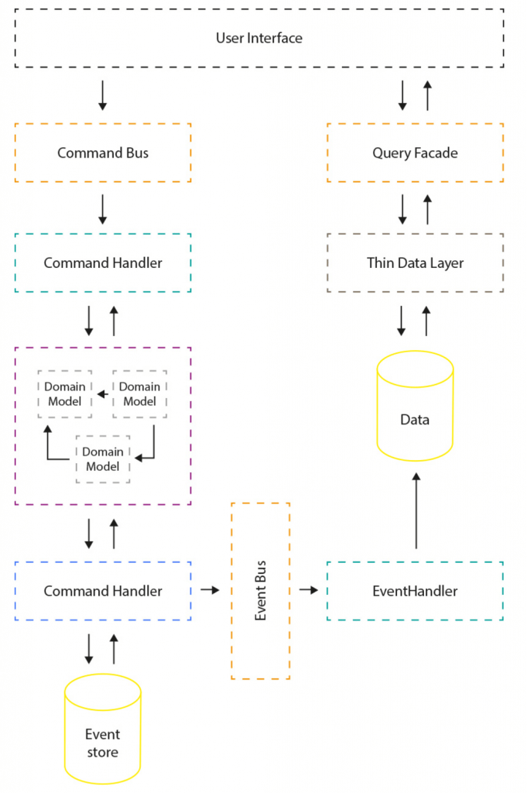  
Fig. 12: Katwatka, Piotr. *Event Sourcing with CQRS*.  
https://www.divante.com/blog/event-sourcing-open-loyalty-engineering

## EventStorming

>EventStorming is a flexible workshop format for collaborative exploration of complex business domains.
>
>It comes in different flavours, that can be used in different scenarios:
>
> * to assess health of an existing line of business and to discover the most effective areas for improvements;
> * to explore the viability of a new startup business model;
> * to envision new services, that maximise positive outcomes to every party involved;
> * to design clean and maintainable Event-Driven software, to support rapidly evolving businesses.
>
> The adaptive nature of EventStorming allows sophisticated cross-discipline conversation between stakeholders with different backgrounds, delivering a new type of collaboration beyond silo and specialisation boundaries.
>
> Brandolini, Alberto. "EventStorming", *EventStorming.com*, last edited on 2020.   
> https://www.eventstorming.com/

  
Fig. 13: Baas-Schwegler, Kenny & Richardson, Chris. *Picture that explains "Almost" Everything*.    
https://github.com/ddd-crew/eventstorming-glossary-cheat-sheet

### EventStorming (WIP)
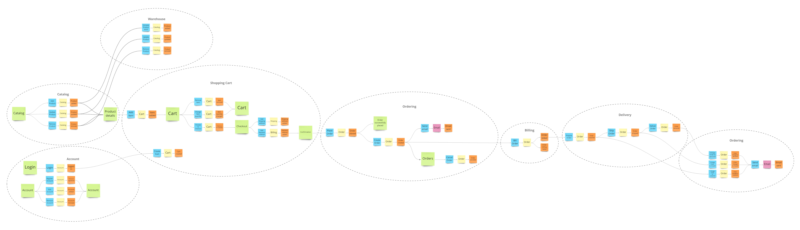

## Domain-driven design (DDD)

> Domain-Driven Design is an approach to software development that centers the development on programming a domain model that has a rich understanding of the processes and rules of a domain. The name comes from a 2003 book by Eric Evans that describes the approach through a catalog of patterns. Since then a community of practitioners have further developed the ideas, spawning various other books and training courses. The approach is particularly suited to complex domains, where a lot of often-messy logic needs to be organized.
>
> Fowler, Martin. "DomainDrivenDesign," *martinfowler.com*, last edited on 22 April 2020.  
> https://martinfowler.com/bliki/DomainDrivenDesign.html

### Aggregate

> Aggregate is a pattern in Domain-Driven Design. A DDD aggregate is a cluster of domain objects that can be treated as a single unit. An example may be an order and its line-items, these will be separate objects, but it's useful to treat the order (together with its line items) as a single aggregate.
>
> Fowler, Martin. "DDD_Aggregate," *martinfowler.com*, last edited on 08 Jun 2015.  
> https://martinfowler.com/bliki/DomainDrivenDesign.html

### Bounded Context

> Bounded Context is a central pattern in Domain-Driven Design. It is the focus of DDD's strategic design section which is all about dealing with large models and teams. DDD deals with large models by dividing them into different Bounded Contexts and being explicit about their interrelationships.
>
> Fowler, Martin. "BoundedContext," *martinfowler.com*, last edited on 15 Jan 2014.  
> https://martinfowler.com/bliki/DomainDrivenDesign.html

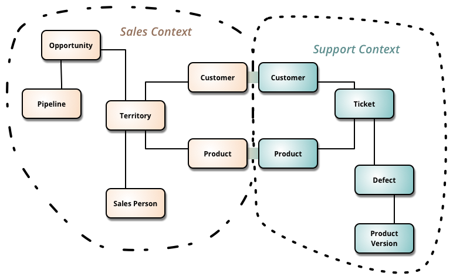  
Fig. 14: Martin, Fowler. *BoundedContext*.    
https://martinfowler.com/bliki/DomainDrivenDesign.html

## Clean Architecture

> Clean architecture is a software design philosophy that separates the elements of a design into ring levels. An important goal of clean architecture is to provide developers with a way to organize code in such a way that it encapsulates the business logic but keeps it separate from the delivery mechanism.
>
> The main rule of clean architecture is that code dependencies can only move from the outer levels inward. Code on the inner layers can have no knowledge of functions on the outer layers. The variables, functions and classes (any entities) that exist in the outer layers can not be mentioned in the more inward levels. It is recommended that data formats also stay separate between levels.
>
> "Clean Architecture." *Whatis*, last edited on 10 Mar 2019.  
> https://whatis.techtarget.com/definition/clean-architecture

  
Fig. 15: C. Martin, Robert. *The Clean Architecture*.    
https://blog.cleancoder.com/uncle-bob/2012/08/13/the-clean-architecture.html

## Running

### Development (secrets)

To configure database resource, `init` secrets in [`./src/WebAPI`](./src/WebAPI), and then define the `DefaultConnection` in `ConnectionStrings` options:

```bash
dotnet user-secrets init
dotnet user-secrets set "ConnectionStrings:DefaultConnection" "Server=<IP_ADDRESS>,1433;Database=EventStore;User=sa;Password=!MyStrongPassword"
```

##### AppSettings

If prefer, define it on WebAPI [`appsettings.Development.json`](./src/WebAPI/appsettings.Development.json) file:

```json5
{
  "ConnectionStrings": {
    "DefaultConnection": "Server=<IP_ADDRESS>,1433;Database=Store;User=sa;Password=!MyComplexPassword"
  }
}
```
### Production

Considering use Docker for CD (Continuous Deployment). On respective [compose](./docker-compose.yml) the **web application** and **sql server** are in the same network, and then we can use named hosts. Already defined on WebAPI [`appsettings.json`](./src/Dotnet6.GraphQL4.Store.WebAPI/appsettings.json) and WebMVC [`appsettings.json`](./src/Dotnet6.GraphQL4.Store.WebMVC/appsettings.json) files:

#### AppSettings

WebAPI

```json5
{
  "ConnectionStrings": {
    "DefaultConnection": "Server=mssql;Database=EventStore;User=sa;Password=!MyStrongPassword"
  }
}
```
### Docker

The [`./docker-compose.yml`](./docker-compose.yml) provide the `WebAPI` and `MS SQL Server`:

```bash
docker-compose up -d
``` 

It's possible to run without a clone of the project using the respective compose:

```yaml
version: "3.7"

services:
  mssql:
    container_name: mssql
    image: mcr.microsoft.com/mssql/server
    ports:
      - 1433:1433
    environment:
      SA_PASSWORD: "!MyStrongPassword"
      ACCEPT_EULA: "Y"
    healthcheck:
      test: /opt/mssql-tools/bin/sqlcmd -S localhost -U sa -P "$$SA_PASSWORD" -Q "SELECT 1" || exit 1
      interval: 10s
      timeout: 3s
      retries: 10
      start_period: 10s
    networks:
      - eventstore

  webapi:
    container_name: webapi
    image: antoniofalcaojr/dotnet-cleanarch-cqrs-eventsourcing-webapi
    environment:
      - ASPNETCORE_URLS=http://*:5000
    ports:
      - 5000:5000
    depends_on:
      mssql:
        condition: service_healthy
    networks:
      - eventstore

  healthchecks:
    container_name: healthchecks-ui
    image: xabarilcoding/healthchecksui
    depends_on:
      mssql:
        condition: service_healthy
    environment:
      - storage_provider=SqlServer
      - storage_connection=Server=mssql;Database=EventStore;User=sa;Password=!MyStrongPassword
      - Logging:LogLevel:Default=Debug
      - Logging:Loglevel:Microsoft=Warning
      - Logging:LogLevel:HealthChecks=Debug
      - HealthChecksUI:HealthChecks:0:Name=webapi
      - HealthChecksUI:HealthChecks:0:Uri=http://webapi:5000/healthz
    ports:
      - 8000:80
    networks:
      - eventstore

networks:
  eventstore:
    driver: bridge
```

Docker commands

MSSQL
```zsh
docker run -d \
-e 'ACCEPT_EULA=Y' \
-e 'SA_PASSWORD=!MyStrongPassword' \
-p 1433:1433 \
--name mssql \
mcr.microsoft.com/mssql/server
```
MongoDB
```zsh
docker run -d \
-e 'MONGO_INITDB_ROOT_USERNAME=mongoadmin' \
-e 'MONGO_INITDB_ROOT_PASSWORD=secret' \
-p 27017:27017 \
--name mongodb \
mongo
```
RabbitMQ
```zsh
docker run -d \ 
-p 15672:15672 \
-p 5672:5672 \
--hostname my-rabbit \
--name rabbitmq \
rabbitmq:3-management
```

## Event store

```sql
CREATE TABLE [CustomerStoreEvents] (
    [Id] int NOT NULL IDENTITY,
    [AggregateId] uniqueidentifier NOT NULL,
    [AggregateName] varchar(30) NOT NULL,
    [EventName] varchar(50) NOT NULL,
    [Event] varchar(1000) NOT NULL,
    CONSTRAINT [PK_CustomerStoreEvents] PRIMARY KEY ([Id])
);
```

```json
{
  "$type": "Domain.Entities.Customers.Events+NameChanged, Domain",
  "Name": "string",
  "Timestamp": "2021-07-12T14:22:23.2600385-03:00"
}
```

## References

* [Event Centric: Finding Simplicity in Complex Systems](https://www.amazon.com/Event-Centric-Simplicity-Addison-Wesley-Signature/dp/0321768221)
* [CQRS Documents - Greg Young](https://cqrs.files.wordpress.com/2010/11/cqrs_documents.pdf)
* [Versioning in an Event Sourced - Greg Young](https://leanpub.com/esversioning/read)
* [Pattern: Event sourcing - Chris Richardson](https://microservices.io/patterns/data/event-sourcing.html)
* [Clarified CQRS - Udi Dahan](https://udidahan.com/2009/12/09/clarified-cqrs/)
* [Udi & Greg Reach CQRS Agreement](https://udidahan.com/2012/02/10/udi-greg-reach-cqrs-agreement/)
* [Event Sourcing and CQRS - Alexey Zimarev](https://www.eventstore.com/blog/event-sourcing-and-cqrs)
* [What is Event Sourcing? - Alexey Zimarev](https://www.eventstore.com/blog/what-is-event-sourcing)
* [Transcript of Greg Young's Talk at Code on the Beach 2014: CQRS and Event Sourcing](https://www.eventstore.com/blog/transcript-of-greg-youngs-talk-at-code-on-the-beach-2014-cqrs-and-event-sourcing)
* [Introduction to CQRS - Kanasz Robert](https://www.codeproject.com/Articles/555855/Introduction-to-CQRS)
* [Distilling the CQRS/ES Capability - Vijay Nair](https://axoniq.io/blog-overview/distilling-the-cqrses-capability)
* [Dispelling the Eventual Consistency FUD when using Event Sourcing - Vijay Nair](https://axoniq.io/blog-overview/dispelling-the-eventual-consistency-fud-when-using-event-sourcing)
* [Why would I need a specialized Event Store? - Greg Woods](https://axoniq.io/blog-overview/eventstore)
* [A Fast and Lightweight Solution for CQRS and Event Sourcing - Daniel Miller](https://www.codeproject.com/Articles/5264244/A-Fast-and-Lightweight-Solution-for-CQRS-and-Event)
* [Event Sourcing: The Good, The Bad and The Ugly - Dennis Doomen](https://www.continuousimprover.com/2017/11/event-sourcing-good-bad-and-ugly.html)
* [What they don’t tell you about event sourcing - Hugo Rocha](https://medium.com/@hugo.oliveira.rocha/what-they-dont-tell-you-about-event-sourcing-6afc23c69e9a)
* [Event Sourcing pattern - MSDN](https://docs.microsoft.com/en-us/azure/architecture/patterns/event-sourcing)
* [CQRS + Event Sourcing, Step by Step - Daniel](https://danielwhittaker.me/2020/02/20/cqrs-step-step-guide-flow-typical-application/)
* [Architectural considerations for event-driven microservices-based systems - Tanmay Ambre](https://developer.ibm.com/articles/eda-and-microservices-architecture-best-practices/)
* [How messaging simplifies and strengthens your microservice application - Callum Jackson](https://developer.ibm.com/articles/how-messaging-simplifies-strengthens-microservice-applications/)
* [Event Sourcing: Aggregates Vs Projections - Kacper Gunia](https://domaincentric.net/blog/event-sourcing-aggregates-vs-projections)
* [Event Sourcing: Projections](https://domaincentric.net/blog/event-sourcing-projections)
* [Advantages of the event-driven architecture pattern](https://developer.ibm.com/articles/advantages-of-an-event-driven-architecture/)