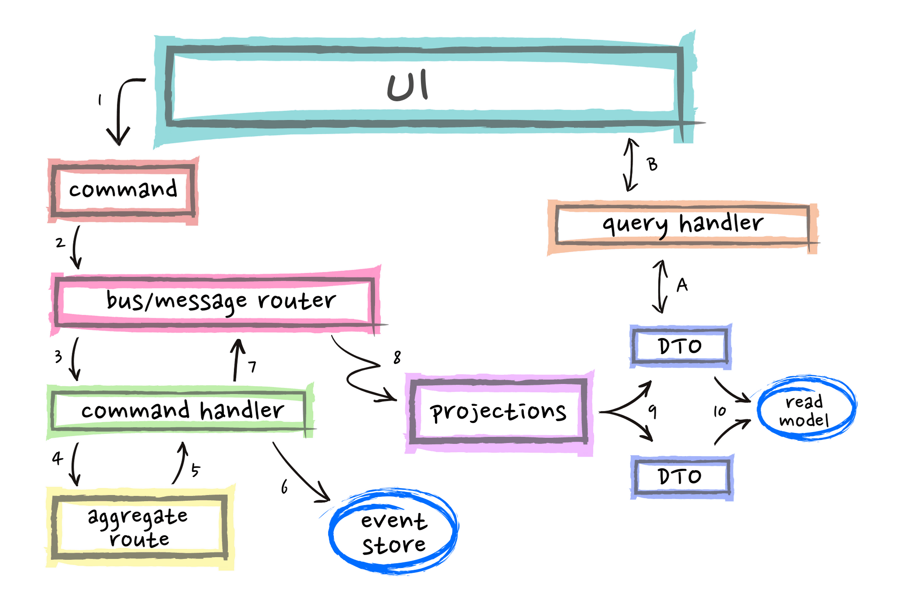

# EDA.CleanArch.CQRS.EventSourcing

> State transitions are an important part of our problem space and should be modelled within our domain.    
> -- <cite> Greg young </cite>

### Give a Star! :star:

## Event-driven architecture (EDA)
> Event-driven architecture (EDA) is a software architecture paradigm promoting the production, detection, consumption of, and reaction to events.      
> -- <cite> https://en.wikipedia.org/wiki/Event-driven_architecture </cite>

## CQRS + Event-sourcing

> Fig. 1: Whittaker, Daniel. *CQRS + Event Sourcing – Step by Step*    
> https://danielwhittaker.me/2020/02/20/cqrs-step-step-guide-flow-typical-application/
## Running

### Development (secrets)

To configure database resource, `init` secrets in [`./src/WebAPI`](./src/WebAPI), and then define the `DefaultConnection` in `ConnectionStrings` options:

```bash
dotnet user-secrets init
dotnet user-secrets set "ConnectionStrings:DefaultConnection" "Server=<IP_ADDRESS>,1433;Database=EventStore;User=sa;Password=!MyStrongPassword"
```

##### AppSettings

If prefer, define it on WebAPI [`appsettings.Development.json`](./src/WebAPI/appsettings.Development.json) file:

```json5
{
  "ConnectionStrings": {
    "DefaultConnection": "Server=<IP_ADDRESS>,1433;Database=Store;User=sa;Password=!MyComplexPassword"
  }
}
```
### Production

Considering use Docker for CD (Continuous Deployment). On respective [compose](./docker-compose.yml) the **web application** and **sql server** are in the same network, and then we can use named hosts. Already defined on WebAPI [`appsettings.json`](./src/Dotnet6.GraphQL4.Store.WebAPI/appsettings.json) and WebMVC [`appsettings.json`](./src/Dotnet6.GraphQL4.Store.WebMVC/appsettings.json) files:

#### AppSettings

WebAPI

```json5
{
  "ConnectionStrings": {
    "DefaultConnection": "Server=mssql;Database=EventStore;User=sa;Password=!MyStrongPassword"
  }
}
```
### Docker

The [`./docker-compose.yml`](./docker-compose.yml) provide the `WebAPI` and `MS SQL Server`:

```bash
docker-compose up -d
``` 

It's possible to run without a clone of the project using the respective compose:

```yaml
version: "3.7"

services:
  mssql:
    container_name: mssql
    image: mcr.microsoft.com/mssql/server
    ports:
      - 1433:1433
    environment:
      SA_PASSWORD: "!MyStrongPassword"
      ACCEPT_EULA: "Y"
    healthcheck:
      test: /opt/mssql-tools/bin/sqlcmd -S localhost -U sa -P "$$SA_PASSWORD" -Q "SELECT 1" || exit 1
      interval: 10s
      timeout: 3s
      retries: 10
      start_period: 10s
    networks:
      - eventstore

  webapi:
    container_name: webapi
    image: antoniofalcaojr/dotnet-cleanarch-cqrs-eventsourcing-webapi
    environment:
      - ASPNETCORE_URLS=http://*:5000
    ports:
      - 5000:5000
    depends_on:
      mssql:
        condition: service_healthy
    networks:
      - eventstore

  healthchecks:
    container_name: healthchecks-ui
    image: xabarilcoding/healthchecksui
    depends_on:
      mssql:
        condition: service_healthy
    environment:
      - storage_provider=SqlServer
      - storage_connection=Server=mssql;Database=EventStore;User=sa;Password=!MyStrongPassword
      - Logging:LogLevel:Default=Debug
      - Logging:Loglevel:Microsoft=Warning
      - Logging:LogLevel:HealthChecks=Debug
      - HealthChecksUI:HealthChecks:0:Name=webapi
      - HealthChecksUI:HealthChecks:0:Uri=http://webapi:5000/healthz
    ports:
      - 8000:80
    networks:
      - eventstore

networks:
  eventstore:
    driver: bridge
```

Docker commands

MSSQL
```zsh
docker run -d \
-e 'ACCEPT_EULA=Y' \
-e 'SA_PASSWORD=!MyStrongPassword' \
-p 1433:1433 \
--name mssql \
mcr.microsoft.com/mssql/server
```
MongoDB
```zsh
docker run -d \
-e 'MONGO_INITDB_ROOT_USERNAME=mongoadmin' \
-e 'MONGO_INITDB_ROOT_PASSWORD=secret' \
-p 27017:27017 \
--name mongodb \
mongo
```
RabbitMQ
```zsh
docker run -d \ 
-p 15672:15672 \
-p 5672:5672 \
--hostname my-rabbit \
--name rabbitmq \
rabbitmq:3-management
```

## Event store

```sql
CREATE TABLE [CustomerStoreEvents] (
    [Id] int NOT NULL IDENTITY,
    [AggregateId] uniqueidentifier NOT NULL,
    [AggregateName] varchar(30) NOT NULL,
    [EventName] varchar(50) NOT NULL,
    [Event] varchar(1000) NOT NULL,
    CONSTRAINT [PK_CustomerStoreEvents] PRIMARY KEY ([Id])
);
```

```json
{
  "$type": "Domain.Entities.Customers.Events+NameChanged, Domain",
  "Name": "string",
  "Timestamp": "2021-07-12T14:22:23.2600385-03:00"
}
```
RabbitMQ/MassTransit

Commands
```ini
Queue: customer-registered, Consumer: Application.UseCases.Customers.EventHandlers.CustomerRegistered.CustomerRegisteredConsumer
Queue: customer-age-changed, Consumer: Application.UseCases.Customers.EventHandlers.CustomerUpdated.CustomerUpdatedConsumer
Queue: customer-name-changed, Consumer: Application.UseCases.Customers.EventHandlers.CustomerUpdated.CustomerUpdatedConsumer
Queue: customer-deleted, Consumer: Application.UseCases.Customers.EventHandlers.CustomerDeleted.CustomerDeletedConsumer
```

Events
```ini
Queue: update-customer, Consumer: Application.UseCases.Customers.Commands.UpdateCustomer.UpdateCustomerConsumer
Queue: register-customer, Consumer: Application.UseCases.Customers.Commands.RegisterCustomer.RegisterCustomerConsumer
Queue: delete-customer, Consumer: Application.UseCases.Customers.Commands.DeleteCustomer.DeleteCustomerConsumer**
```

Queries
```ini
Queue: get-customers-details-with-pagination-query, Consumer: Application.UseCases.Customers.Queries.GetCustomersWithPagination.GetCustomersDetailsWithPaginationQueryConsumer
Queue: get-customer-detail-query, Consumer: Application.UseCases.Customers.Queries.GetCustomerDetails.GetCustomerDetailQueryConsumer
```
## References

* [Event Centric: Finding Simplicity in Complex Systems](https://www.amazon.com/Event-Centric-Simplicity-Addison-Wesley-Signature/dp/0321768221)
* [CQRS Documents - Greg Young](https://cqrs.files.wordpress.com/2010/11/cqrs_documents.pdf)
* [Versioning in an Event Sourced - Greg Young](https://leanpub.com/esversioning/read)
* [Pattern: Event sourcing - Chris Richardson](https://microservices.io/patterns/data/event-sourcing.html)
* [Clarified CQRS - Udi Dahan](https://udidahan.com/2009/12/09/clarified-cqrs/)
* [Udi & Greg Reach CQRS Agreement](https://udidahan.com/2012/02/10/udi-greg-reach-cqrs-agreement/)
* [Event Sourcing and CQRS - Alexey Zimarev](https://www.eventstore.com/blog/event-sourcing-and-cqrs)
* [Transcript of Greg Young's Talk at Code on the Beach 2014: CQRS and Event Sourcing](https://www.eventstore.com/blog/transcript-of-greg-youngs-talk-at-code-on-the-beach-2014-cqrs-and-event-sourcing)
* [Introduction to CQRS - Kanasz Robert](https://www.codeproject.com/Articles/555855/Introduction-to-CQRS)
* [Distilling the CQRS/ES Capability - Vijay Nair](https://axoniq.io/blog-overview/distilling-the-cqrses-capability)
* [Dispelling the Eventual Consistency FUD when using Event Sourcing - Vijay Nair](https://axoniq.io/blog-overview/dispelling-the-eventual-consistency-fud-when-using-event-sourcing)
* [Why would I need a specialized Event Store? - Greg Woods](https://axoniq.io/blog-overview/eventstore)
* [A Fast and Lightweight Solution for CQRS and Event Sourcing - Daniel Miller](https://www.codeproject.com/Articles/5264244/A-Fast-and-Lightweight-Solution-for-CQRS-and-Event)
* [Event Sourcing: The Good, The Bad and The Ugly - Dennis Doomen](https://www.continuousimprover.com/2017/11/event-sourcing-good-bad-and-ugly.html)
* [What they don’t tell you about event sourcing - Hugo Rocha](https://medium.com/@hugo.oliveira.rocha/what-they-dont-tell-you-about-event-sourcing-6afc23c69e9a)
* [Event Sourcing pattern - MSDN](https://docs.microsoft.com/en-us/azure/architecture/patterns/event-sourcing)
* [CQRS + Event Sourcing, Step by Step - Daniel](https://danielwhittaker.me/2020/02/20/cqrs-step-step-guide-flow-typical-application/)